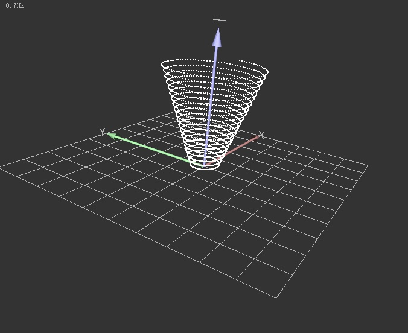

# QtCloudViewer: A light-weighted tools for visulizing Point Cloud by CMake, libglviewer, PCL and Qt

## 主要功能
- 主线程显示点云
- 切换点云大小、原点坐标

## Dependency
- [CMake](https://cmake.org)
- [PCL](https://pointclouds.org)
- [Qt >= 5.1](https://download.qt.io/official_releases/)
- (*Important) [libglviewer](http://libqglviewer.com). This project use only basic functional of libglviewer, in the 'QGLViewer' folder.